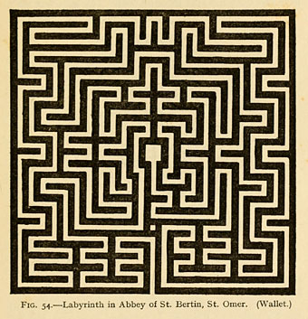

# LabyrintheRobot
LabyrintheRobot

Après nous avoir enseigné les bases de l’architecture en informatique, un projet nous a été confié, celui de développer, grâce à nos nouvelles connaissances, un programme pouvant être utilisé sur les cartes d'évaluations **Texas Instrument EvalBot**. Pour ce faire nous devions utiliser le langage le plus bas niveau (juste au-dessus du binaire directement) disponible sur cette carte équipée un SoC (System on a Chip) Cortex-M3. Ce projet permet d'approfondir nos connaissances grâce à un cas pratique et surtout réel, ce qui le rend d’autant plus complexe.

*******

Table des matières
1. [Description du projet](#7description)
2. [Scénario](#scenario)
3. [Labyrinthe Saint-Omer](#labyrinthe)
4. [Problèmes rencontrés](#problemes)
5. [Explication des GPIO](#gpio)

*******

  

## Description du projet

Pour le projet EvalBot, il nous a été demandé de programmer en Assembleur ARMv7, pour la carte Texas Instrument EvalBot équipé d’un Cortex-M3, un programme qui permettrait d’exploiter plusieurs éléments de la carte. Soit au moins les leds (2 leds présentes sur la carte), les moteurs (2 moteurs permettant de faire se déplacer la carte), les boutons (2 boutons sur le dessus de la carte) et enfin les bumpers (2 bumpers sur l’avant de la carte pour notamment détecter les collisions).
	Pour ce faire, nous avons réfléchi à un scénario qui pourrait exploiter les composants requis, voire plus. De là sont sorties nos idées de scénarios explicités ci-dessous.

*******

## Scénarios réalisés:

Pour mener à bien ce projet, nous avons donc modifié les scénarios, et notamment ajouté un nouveau mode dit “IDLE” qui permet la transition entre ces derniers. Ceux-ci sont décrits ci-dessous:
Le mode "IDLE", est un mode qui s’active automatiquement au démarrage de la carte EvalBot, dans lequel le robot n’effectue aucune action visible, mais attend les ordres avant d'exécuter des tâches. En effet, il lit en continue les entrées sur les deux boutons (Switch 1 et Switch 2) afin d’activer le scénario correspondant au bouton pressé.
Le premier scénario est lancé à l’appui du premier bouton (Switch 1), dans celui-ci : le robot avance en ligne droite jusqu’à la rencontre d’un obstacle (matérialisé) par les bumpers (Bumper 1 et/ou Bumper 2). Après la collision, le robot se met à reculer, et les leds clignotent de manière alternée, très rapidement, pendant un court instant. Enfin, la carte repasse automatiquement en mode “idle” en attente de futures instructions.

Le deuxième scénario, qui est lancé par l’appui de deuxième bouton (Switch 2), fait avancer le robot et allume les deux leds simultanément. À la rencontre d’un obstacle (Bumper 1 et/ou Bumper 2) les deux leds s’éteignent et la carte fait une rotation d’environ 90 degrés dans une direction aléatoire (horaire ou antihoraire) avant de relancer automatiquement le scénario. De plus, tant que les leds de la carte sont allumées, le robot avance en ligne droite, mais il est possible de repasser manuellement en mode “idle” en appuyant sur le premier bouton (Switch 1).
Nous avons aussi réalisé un organigramme de flux permettant de comprendre le fonctionnement du programme présent sur l’EvalBot.

*******

## Labyrinthe Saint-Omer, notre inspiration:
Le deuxième scénario comprend l’élaboration d’un labyrinthe. Nous avons donc choisi le mystérieux labyrinthe de la cathédrale de Saint-Omer daté de 1716. Nous l’avions particulièrement apprécié pour sa beauté, mais aussi pour la signification qu’il porte :  “les difficultés de la vie sur le chemin qui conduit à Dieu”, ce qui est en parfaite corrélation avec les chemins que devra traverser notre Zombie Robot pour parvenir à sa fin.

Figure 1.1 : Labyrinthe situé sur le sol, à la croisée des nefs de la Cathédrale de Saint-Omer

Pour réaliser ce dernier, nous avons utilisé un logiciel de DAO i.e AutoCAD, afin de modéliser le labyrinthe en 2D et ensuite procéder à la construction de la maquette. Grâce à ce logiciel, nous nous sommes rendu compte que proportionnellement à la taille d’EvalBot le labyrinthe dépasse 10,86 m². Nous avons dû découper le labyrinthe en 4, et nous avons décidé de choisir le dernier 1⁄4 (voir Annexe 1.1 : Labyrinthe découpé en 1⁄4 pour faciliter la conception),  et la taille du labyrinthe fait désormais 2,72 m².
Etant donné que le labyrinthe est composé de nombreuses pièces, ce plan (Annexe 1.2 : Maquette du labyrinthe et le rendu final) nous servira comme plan de calepinage ce qui facilitera la reproduction de celui-ci. 

*******

  

## Problèmes rencontrés
	Durant la réalisation du projet nous avons dû faire face à plusieurs problèmes, qui expliquent notamment les différences entre les scénarios prévus des scénarios réalisés au final.
## Les changements:
	Nous avons effectué des modifications sur les deux scénarios tout en essayant de rester le plus proche possible du scénario originel.
L’utilisation de l’écran OLED a été retirée dans le premier scénario.
Le robot recule et fait clignoter rapidement et de manière alternée les leds au lieu de rester statique à la rencontre avec un obstacle dans le premier scénario.
Le buzzer n’est pas utilisé dans le deuxième scénario.
Au lieu de faire un degré de rotation aléatoire dans le deuxième scénario, nous avons préféré partir sur un sens de rotation aléatoire.
Les leds, dans le deuxième scénario, s'allument lorsque le robot avance et s'éteignent lorsqu’il procède à une rotation.
 
Ces quatre changements sont les principales différences entre les deux versions des scénarios.
Les raisons:
	Chacun de ces changements a été apporté pour une raison différente, les voici:
Pour le cas de l’écran OLED et du buzzer, c’est par manque de temps que nous avons préféré ne pas les intégrer, en effet le projet nécessitait pas mal de recherche et pour être certain de terminer et d’avoir un programme fonctionnel et propre nous avons préféré faire sans l’utilisation de ces deux périphériques.
L’utilisation des leds dans les deux scénarios vient combler notre oubli dans ce qui était prévu. De plus, dans le premier scénario nous avons choisi de faire reculer le robot pour garder une cohérence.
Pour la durée de rotation, le problème venait du fait qu’il est beaucoup plus simple d’obtenir un nombre pseudo-aléatoire en 0 et 1, qu’un très grand nombre nécessaire pour faire la boucle.

*******

  

## Explication des GPIO:
Pour les différents périphériques il a fallu activées certain ports : le port D pour les boutons (0x40007000), le port E pour les bumpers (0x40024000), le ports F pour les leds (0x40025000) et le port H pour les moteurs (0x40027000). Il a fallu aussi activer les GPIO nécessaires pour faire fonctionner les périphériques notamment pour les boutons et les bumpers : Input PUR et Output DEN. Et pour les leds : Output DIR, Output DEN et Output DR2R. Ces GPIO sont nécessaires au bon fonctionnement des périphériques.

*******

© Réalisé par **Charles Batchaev** et **Tristan Nobre**
